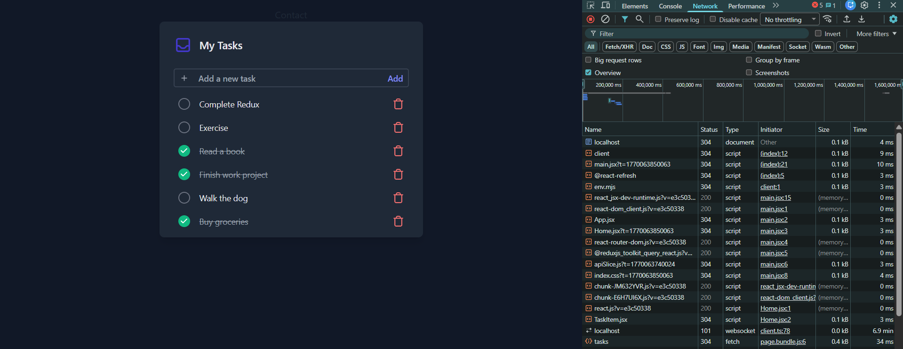

# 🚀 RTK Query Todo App – Data Fetching Best Practices in React

<p align="center">
  
  &nbsp;&nbsp;&nbsp;
</p>

<p align="center">
  <strong>A simple CRUD-based Todo app built to explain modern data fetching in React using Redux Toolkit & RTK Query</strong>
</p>

---

## 📌 About the Project

This repository demonstrates **best practices for data fetching in React** using **Redux Toolkit Query (RTK Query)**.

The goal of this project is **simplicity + clarity** — to explain RTK Query concepts **from scratch**, while still following **production-level patterns**.

The app uses a **JSON Server** as a mock backend and performs full **CRUD operations** (Create, Read, Update, Delete) on todos.

---

## 🧠 Key Concepts Covered

- ✅ RTK Query setup from scratch  
- ✅ Automatic data fetching & caching  
- ✅ Cache invalidation & refetching  
- ✅ Optimistic updates for better UX  
- ✅ Handling low network strength scenarios  
- ✅ Efficient state management without boilerplate  
- ✅ Scalable frontend data-handling patterns  

---

## ⚡ Why RTK Query?

RTK Query provides **powerful features out of the box**:

- 🔥 **Automatic caching** (no manual cache logic)
- 🔄 **Request deduplication**
- 🚀 **Optimistic updates** for instant UI feedback
- 🧠 **Smart refetching** on focus / reconnect
- ❌ Eliminates the need for `useEffect + useState` for data fetching

This makes it perfect for applications running under:
- High traffic loads
- Poor or unstable network conditions

---

## 🛠️ Tech Stack

- **React**
- **Redux Toolkit**
- **RTK Query**
- **React Redux**
- **JSON Server** (mock backend)
- **Vite**

---

## 📂 Project Features

- 📥 Fetch todos from JSON Server
- ➕ Add new todos
- ✏️ Update existing todos
- ❌ Delete todos
- ⚡ Optimistic UI updates
- 🧩 Clean and maintainable architecture

---

## 🖼️ Screenshots

<p align="center">
  
</p>

---

## 📁 Folder Structure (Simplified)

src/  
│── services/  
│ └── api.js # RTK Query API slice  
│── components/   
│── pages/   
│── store.js # Redux store setup   
│── main.jsx # App entry with Provider  

---

## 🚀 Getting Started

### 1️⃣ Clone the repository
```bash
git clone https://github.com/your-username/your-repo-name.git
cd your-repo-name
```

### 2️⃣ Install dependencies
```bash
npm install
```

### 3️⃣ Start JSON Server
```bash
npx json-server --watch db.json --port 3000
```

### 4️⃣ Run the app
```bash
npm run dev
```
---

## 🎯 Learning Outcome

- By exploring this project, you will learn:
  
- How RTK Query simplifies data fetching

- How caching works by default

- How to write cleaner, scalable frontend logic

- How optimistic updates improve perceived performance

- How to structure real-world Redux applications

---

## 🤝 Contribution

Feel free to fork this repo, experiment, and improve it.
Suggestions and improvements are always welcome!


